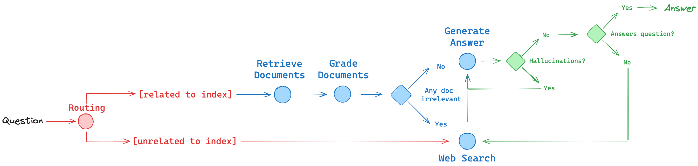

# Local RAG agent with LLaMA3

We'll combine ideas from paper RAG papers into a RAG agent:

- **Routing:**  Adaptive RAG ([paper](https://arxiv.org/abs/2403.14403)). Route questions to different retrieval approaches
- **Fallback:** Corrective RAG ([paper](https://arxiv.org/pdf/2401.15884.pdf)). Fallback to web search if docs are not relevant to query
- **Self-correction:** Self-RAG ([paper](https://arxiv.org/abs/2310.11511)). Fix answers w/ hallucinations or don’t address question



## Usage

Use [Ollama](https://ollama.ai/) and [llama3](https://ollama.ai/library/llama3):

```
ollama pull llama3
```

Download required packages

```
pip install -r requirements.txt
```

Rename `example_config.yaml` to `config.yaml` and replace <API_KEY> with your own

```yaml
OPENAI:
  API_KEY: <API_KEY>
  EMBEDDING_MODEL: text-embedding-3-small

LANGCHAIN_API_KEY: <API_KEY>

TAVILY_API_KEY: <API_KEY>
```

Run the app

```
python app.py
```

## Execution Example 1

### 1. Input question
```
Question:
Who are the Bears expected to draft first in the NFL draft?
```

### 2. Search the Web
```
Document1:
NBC Universal, Inc. All signs point to the Bears selecting Caleb Williams with the No. 1 overall pick when the 2024 NFL draft finally begins on Apr. 25. But even though the entire world seemingly knows what's going to happen at the top of the board, the pick might not be official at 7 p.m. when the draft starts.
```

```
Document2:
Chicago Bears 2024 NFL Draft Picks. Round 1: No. 1 (from CAR) Round 1: No. 9. Round 3: No. 75. Round 4: No. 122 (from PHI) 2023 was another lackluster season for the Chicago Bears, finishing at the bottom of the NFC North with a 7-10 record (a disappointment, but, it should be noted, improvement on 2022's bottom of the barrel 3-14 showing).
```

### 3. Generate answer
```
Answer:
The Bears are expected to draft Caleb Williams with their No. 1 overall pick.
```

### 4. Check hallucination
```
Give a binary score 'yes' or 'no' score to indicate whether the answer is grounded in / supported by a set of facts.

Document 1:
NBC Universal, Inc. All signs point to the Bears selecting Caleb Williams with the No. 1 overall pick when the 2024 NFL draft finally begins on Apr. 25. But even though the entire world seemingly knows what's going to happen at the top of the board, the pick might not be official at 7 p.m. when the draft starts.

Document2:
Chicago Bears 2024 NFL Draft Picks. Round 1: No. 1 (from CAR) Round 1: No. 9. Round 3: No. 75. Round 4: No. 122 (from PHI) 2023 was another lackluster season for the Chicago Bears, finishing at the bottom of the NFC North with a 7-10 record (a disappointment, but, it should be noted, improvement on 2022's bottom of the barrel 3-14 showing).

 ...

Answer:
The Bears are expected to draft Caleb Williams with their No. 1 overall pick.
```

```
score: "yes"
```

### 5. Check response has answer the question
```
Answer:
The Bears are expected to draft Caleb Williams with their No. 1 overall pick.

Question:
Who are the Bears expected to draft first in the NFL draft?
```

```
score: "yes"
```